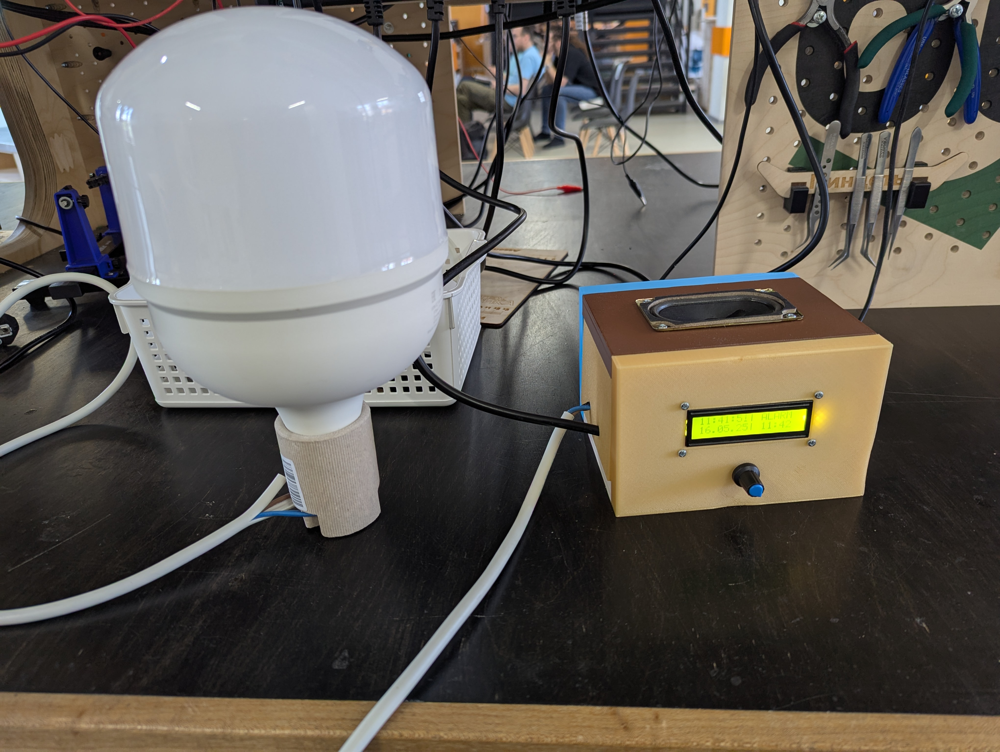

# Экстремальный будильник

## Задача

Перед нами стояла задача создания будильника. При его разработки мы установили 2 основных критерия, будильник должен быть:
1. Дешёвым в производстве(Большинство аналогов на рынке крайне дороги)
2. Безотказным

## Решение

В качестве "сердца" будильника мы выбрали плату Arduino Nano. Такое решение мы приняли по большей степени из-за простоты прототипирования и написания кода. 
Так же мы выбрали LCD дисплей 16x2 с I2C адаптером, он полностью смог покрыть наше потребности в выводе текста.
Для отсчёта времени использовался rtc модуль с батарейкой.
При создании функционального дизайна будильника было принято решение, что сигнал будет не только звуковым но и световым. 
По этой причине мы взяли светодиодную лампу на 100 Вт и запитали её через реле(250В 10А с управляющим напряжением 5В). 
Для подачи звукового сигнала использовался MP3 DFPlayer mini + sd карта + Динамик 3W 4Ом.
Для управления дисплеем был использован энкодер. Есть возможность выставлять время с точностью до минут.
Для питания использовался понимажающий преобразователь 220AC $\rightarrow$ 5DC.
Корпус для устройства распечатали на 3d принтере.

## Результат

Нам удалось разработать и создать будильник с звуковым и световым сигналом для пробуждения. 
В результате испытаний будильник показал высокую эффективность и безотказность.

## Проблемы с которыми столкнулись

Основной проблемой с которой мы столкнулись был неисправный модуль для sd карты из-за которого было потеряно много времени.

## Заключение и планы на улучшение

В будущих итерациях будильника хотелось бы добавить возможность выбирать мелодию и сделать синхронизацию с будильником на телефоне.
